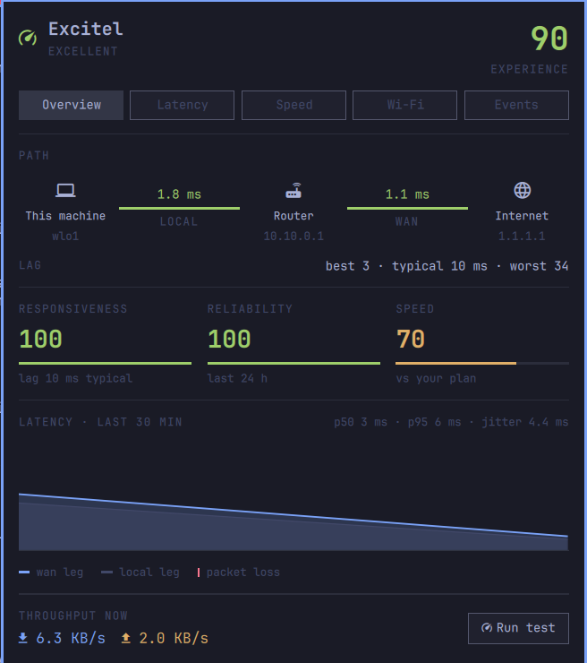
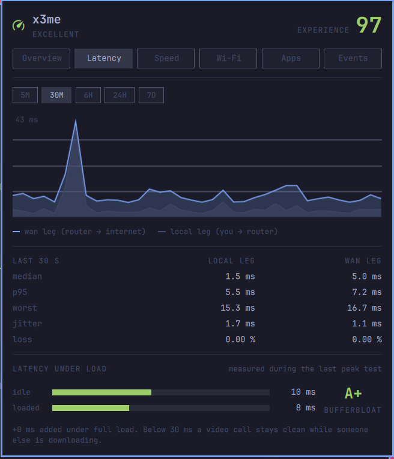
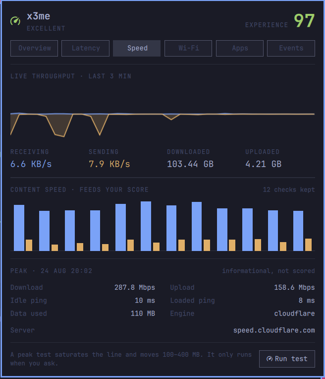
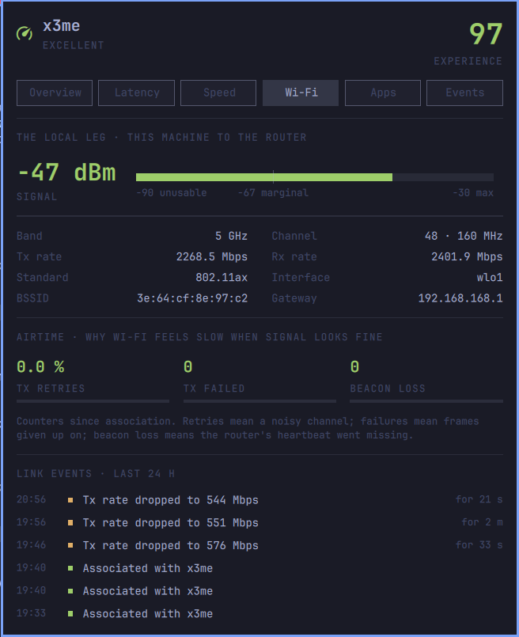
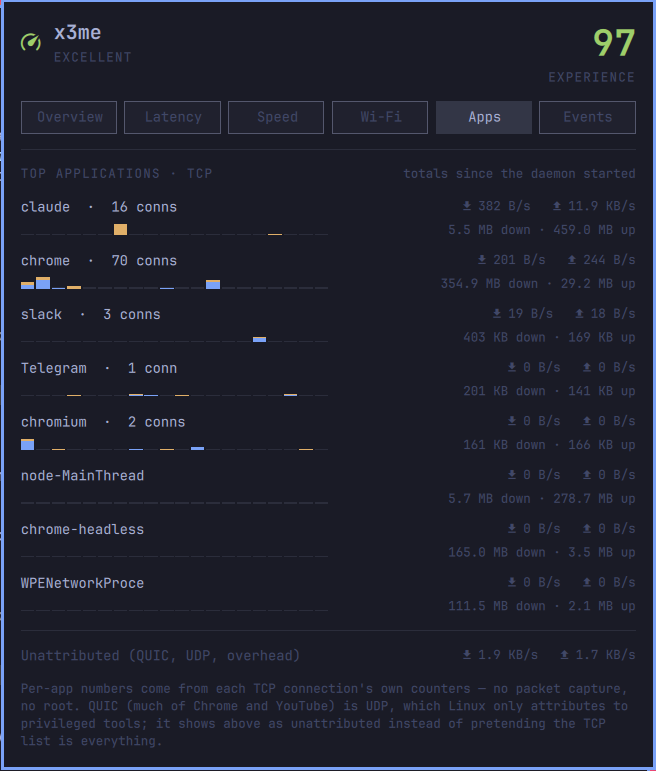
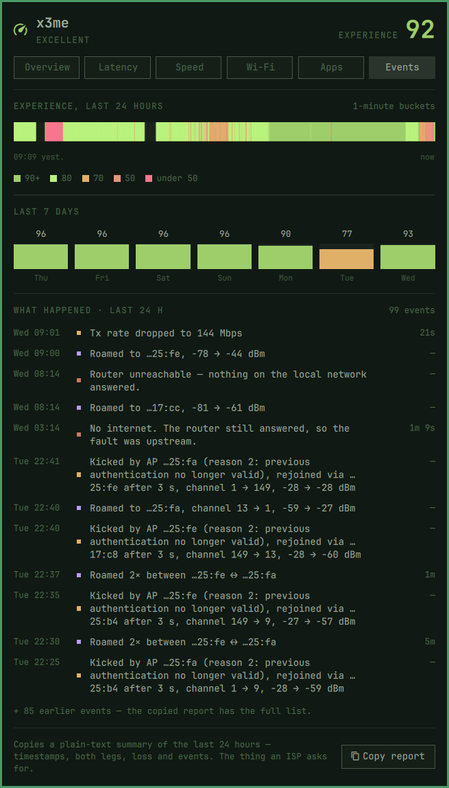

# Nexthop

**Is it your Wi-Fi, or your ISP? Know before you reboot anything.**

Nexthop sits in your [Omarchy](https://omarchy.org) bar and watches both
halves of your connection — this machine to the router, and the router to
the internet. When things feel slow, one glance tells you which side of
the router owns the problem.



## Why you'd want it

- **An answer, not a graph.** One 0–100 score in the bar, colour-coded.
  Green means stop worrying. When it drops, the panel says why — in the
  words you'd use to a person: responsiveness, reliability, speed.
- **"Is it me or is it them", settled.** The Overview draws your laptop,
  your router and the internet with a live latency number on each leg.
  The slow leg is the guilty one.
- **Proof your ISP can't wave away.** Every outage is logged with its
  start, duration and which side failed. *Copy report* produces the
  plain-text summary a support desk actually asks for.
- **It sees what you can't.** A router silently kicking your laptop off
  Wi-Fi, an access point renegotiating to a crawl, the 3 a.m. outage that
  was over before breakfast — all in the log, with timestamps and
  durations.
- **Speed answers without speed tests.** Small hourly checks keep the
  speed score honest; the big saturating test runs only when you ask.

## It won't get in your way

- **No root, ever.** No sudo, no capabilities, no packet capture. It runs
  as your user and reads what any process may read.
- **You won't feel it.** About 3 % of one CPU core and ~30 MB of memory —
  no fan, no stutter, nothing competing with your work.
- **It doesn't clog your line.** The probes are pings and payload-free
  handshakes and add up to a few MB an hour; the hourly speed check is
  about 14 MB and can be turned off. Nothing saturates your connection
  unless you press the button.
- **Private by construction.** Everything it measures stays on your machine
  — no account, no cloud, no telemetry. Even your own IP is shown masked, so
  a screenshot of the panel is safe to post. The one thing it asks the
  outside world is whether a newer version exists: once a day it asks the
  repository you installed from, sends nothing about you, and shows a small
  marker if so. Turn that off in the panel's Setup tab (the cog) and it
  asks nothing.

## Made for Omarchy

Nexthop is not a ported app — it is built for this desktop. It follows
your theme automatically, uses the shell's own type and spacing, and
opens instantly from the bar like every other panel. It is MIT-licensed,
built in the open, and shaped by community feedback — the masked WAN
address on the Overview came from a reader's suggestion the day after
launch.

## Install

```bash
omarchy plugin add https://github.com/x3me/omarchy-nexthop.git --enable
```

Updating is Omarchy's own `omarchy plugin update`, which shows you
what changed before applying it. Nexthop checks once a day whether a newer
version is published and marks the panel header if so; it never installs
anything itself.

Requirements: `python3`, `ping`, `curl`, `ss`, `ip` and `git` (all present on
a stock Omarchy; `git` only serves the daily update check), `iw` for Wi-Fi
detail, `wl-copy` for Copy report, optionally `nmcli` for the metered flag
and `speedtest` (Ookla) for peak tests.

| Latency, by leg | Speed |
|---|---|
|  |  |

| Wi-Fi | Applications |
|---|---|
|  |  |

The event log, naming who did what — including the router that kicks:



## Using it

- **Bar widget**: the index, the lag figure, or just the icon
  (`displayMode` on the widget's entry in `~/.config/omarchy/shell.json`).
  Colour is the verdict; during an outage it shows how long you've been
  down. Click opens the panel, middle-click runs a peak test.
- **Panel tabs**: Overview (is it me or is it them), Latency (window picker,
  per-leg stats, latency under load), Speed (content history + last peak),
  Wi-Fi (the local leg in detail, airtime, link events), Apps (who is using
  the connection), Events (what happened + Copy report), and a Setup cog
  with the four settings worth reaching from the panel. Arrow keys or 1–6
  switch tabs.
- **CLI**: `bin/nexthop live | query --window 24h | events | tests | report | peak`
  — all JSON except `report`.
- **IPC**: `omarchy-shell io.github.x3me.nexthop toggle | speedTest |
  showTab Latency`

## What it measures

- **Two-leg latency, twice a second.** One persistent probe to your
  gateway, others to the internet. The difference between the legs is
  your ISP; the gateway leg is your Wi-Fi.
- **Lag** — one number for how the connection feels, folding latency, jitter
  (RFC 3550 IPDV) and packet loss, reported as best / typical / worst.
- **An experience index (0–100)** from three components — the weakest sets
  the number and the other two nudge it, so one broken dimension cannot
  hide behind two good ones:
  - *Responsiveness* — scored from lag
  - *Reliability* — uptime, charged in time: outages in full, brief
    self-healed interruptions at half
  - *Speed* — scored from small periodic **content checks** (~14 MB,
    hourly by default), not from saturating speed tests. No configuration:
    the score answers "is it fast enough" on an experience-anchored curve
    (diminishing returns past ~100 Mbps), minus a penalty when the line
    drops well below **its own recent p90** — so shared-office variance
    stays quiet while genuine degradation shows. Setting a plan in the
    widget settings switches to plan-accountability scoring instead
- **Peak speed tests, on demand only.** Prefers the official Ookla
  `speedtest` CLI when installed; falls back to Cloudflare, then fast.com —
  both need nothing beyond `curl`. Loaded latency (bufferbloat) is captured
  during every run by the probes that were already watching.
- **Wi-Fi health**: signal against a labelled scale, band/channel/rates,
  and the airtime counters (retries, failures, beacon loss) that explain
  why Wi-Fi feels slow when the signal bar looks full.
- **Link events**: every change of access point says who ended the
  previous association — a *roam* (this machine chose to move), a *kick*
  (the access point deauthenticated us, with its 802.11 reason code) or a
  *drop* (the link fell over) — plus channel and signal deltas,
  associations, and sustained Wi-Fi rate drops, logged with durations.
- **WAN address**: the IP this connection appears from, on the Overview
  path — masked (`103.87.…`) with tap-to-reveal, because panel screenshots
  end up on forums. Asked of `speed.cloudflare.com`, a host the daemon
  already talks to; shown live, never written to history.
- **Per-application traffic** — top apps by TCP connection counters
  (`ss -tinp`, no root, no packet capture), each with a one-minute history
  strip and session totals. What Linux won't attribute without privileges
  (QUIC/UDP, overhead) is shown as its own bucket rather than hidden.
- **Outage detection** with a notification once an outage has lasted a few
  seconds and one when it clears — naming the leg that failed. Brief
  self-healed interruptions are logged, never notified. A wan outage needs the
  probes to agree: if TCP handshakes keep succeeding while pings go
  unanswered, the log records an "ICMP went quiet" event instead — no
  alarm for downtime you are not having.
- **History**: per-minute for 7 days (configurable), hourly for a year,
  every test and event kept. A month of monitoring stays under ~12 MB.
- **Copy report** — a plain-text summary of the window you are looking at,
  with timestamps, both legs and loss. The thing an ISP actually asks for.

## How it works

The QML plugin is a thin reader. All measurement lives in **nexthopd**, a
Python 3 daemon (standard library only, no pip), spawned and supervised by
the plugin's shell service. Five files are the whole contract — four the
daemon writes, one the panel writes for it:

| file | cadence | consumer |
|---|---|---|
| `~/.local/state/nexthop/live.json` | 2× per second | the bar widget |
| `~/.local/state/nexthop/recent.json` | every 5 s | the panel's 30-min graphs |
| `~/.local/state/nexthop/apps.json` | every 3 s | the Apps tab |
| `~/.local/state/nexthop/history.db` | 1-min rows | `nexthop query`, longer windows |
| `~/.local/state/nexthop/config.json` | when a setting changes | the daemon — the one file the panel writes |

The daemon never talks to the shell, so either side restarts without the
other noticing — and your history survives every theme change.

To keep monitoring while the shell is down, install the optional
systemd unit (see the comments in [`nexthopd.service`](nexthopd.service));
the daemon holds a lock, so the shell service simply attaches.

### What it talks to, and what that costs

The internet leg is measured by a small pool of instruments: ICMP and a
TCP handshake to the anchor you configure (`1.1.1.1` by default), plus TCP
handshakes to `speed.cloudflare.com` and `dns.google` — one probe target
outside Cloudflare, so a Cloudflare incident cannot silence the whole
pool. The **two best** instruments — fewest losses, steadiest tails,
re-ranked every five minutes with flap damping — feed the score; the rest
idle at a tenth of the rate. One anchor having a bad day stops being your
connection's bad day. Beyond the pool, the only other contacts are the
speed-test hosts named at the end and the once-a-day update check against
the repository you installed from.

| Probe | Where | Cost |
| --- | --- | --- |
| ICMP | your gateway, and the anchor while seated | ~30 MB/day per target on the wire at the default 500 ms — two 84-byte packets a second; the gateway's share never leaves your LAN |
| TCP handshakes | the instrument pool, port 443, ~1/s while seated | ~20 MB/day per seated instrument — connections opened and closed, no payload |
| Reachability check | speed.cloudflare.com/cdn-cgi/trace | one ~1 KB HTTPS request when the network changes and hourly after that; every 30 s only while a sign-in page is suspected. Proves the real internet answered, and supplies the WAN address |
| Content check | speed.cloudflare.com | ~14 MB each, hourly, and can be turned off |
| Peak test | Ookla / Cloudflare / fast.com | up to ~600 MB, **only ever when you ask** |
| Update check | the repository you installed from (`git ls-remote`) | one request a day, carrying nothing about you; off in the Setup tab |

The TCP probes exist because ICMP is not what applications
experience: routers commonly answer pings from hardware while real traffic
waits in the queues that actually cause delay, and they rate-limit pings
under load. Measuring both, against the same host, shows the difference
rather than assuming it.

Peak tests size themselves to saturate the line for ~10 s each way — far
less on a slow one — and run only from the panel, by middle-clicking the
bar widget, or via IPC.

**Privileges: none.** No sudo, no capabilities, no packet capture. The
daemon runs as your user; everything it reads is world-readable (`/sys`
counters, `ping`, `iw`, `ss`).

## Remove

```bash
omarchy plugin remove io.github.x3me.nexthop
```

Measurement history stays in `~/.local/state/nexthop/`; delete that
directory too if you want nothing left behind. If you installed the
optional systemd unit: `systemctl --user disable --now nexthopd` and
remove `~/.config/systemd/user/nexthopd.service`.

## Development

```bash
python3 -m unittest discover -s test    # fixtures recorded from real hardware
python3 -m nexthopd                     # run the daemon in the foreground
```

Design mockups live in `design/` as the source artboards of the project's
design canvas.

## License

MIT © [Extreme Labs](https://github.com/x3me)
